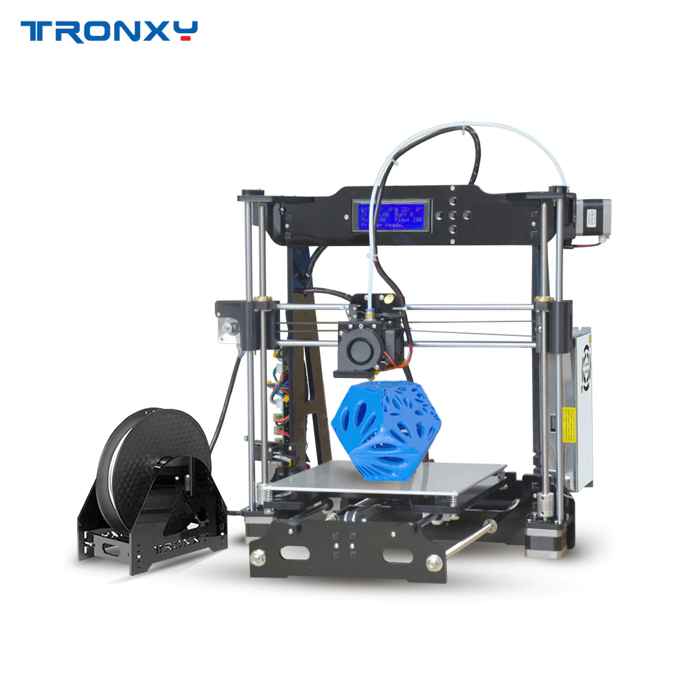
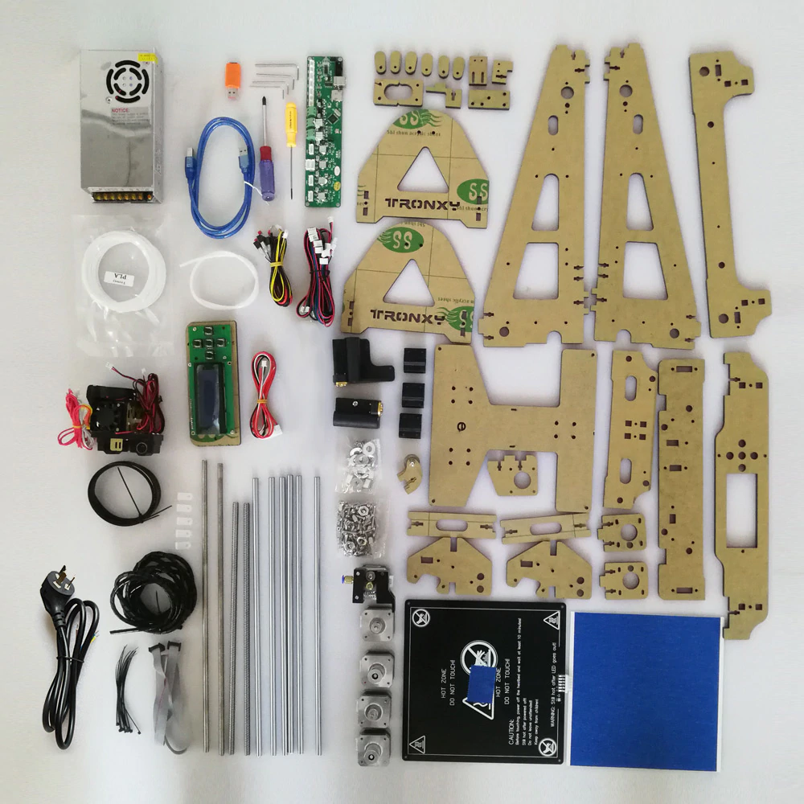

# TRONXY - Add Auto Leveling !


## My Story
My story with this 3D printer, back in 2017 I bought two of these 3D printers in a hope to make business with them, and provide 3D printing services to my customers who where hobbyist in robotics and university engineering projects. how ever the business went south since my printing quality was bad and several prints didn't go well because of the bed leveling issue. and the amount of time it takes me to level the 3D printer before every print is 5-10 minutes, imagine every print I need to do this. later on they where laying down in my work shop not knowing what to do with them and I didn't want to throw them away because they cost me some money and I just refuse to throw them or give them away. So I called the supplier if there was a possibility of upgrading this 3D printer !? the supplier said he stopped 3D printing business long time ago, so I looked around the internet to find solutions sadly I couldn't find any person who did it and willing to share the configuration file nor made a repo about it. so I decided I will do it the hard way its either I succeed or die trying.

## Who is this for ?
This repository is created for people who bought this 3D printer and got stuck with it, so this repository is all about upgrading the functionality of the TRONXY 3D printer and add an auto leveling feature to it and more.

#### Note :
This doesn't require you to change the board, you are going to deal with every thing that we have, you need to just add a probe and make a small circuit and 3D print one part that will hold the probe in place.

## 1st What do you get with TRONXY DIY 3D printer kit

This 3D printer comes equipped with the following
* [Melzi v2 Controller Board](https://reprap.org/wiki/Melzi)
* [ZONESTAR](./images/12.jpg) 20x4 Lines LCD Display With 4 Analog Push Buttons
* [Single Extruder & Hot End](./images/15.jpg)
* Heated Bed
* Three End Stop Switches For X, Y, Z
* Five Stepper Motors
* ATX Power Supply 12V 15Amps
* Cables Connector For All (Steppers, End Stops, Heaters, Fans, Thermistors)

## Follow The Steps To Add Auto Leveling Feature
1. Software Pre request
  * You must have VSCode installed or [download](https://code.visualstudio.com/download) it and install it
  * You must install [Platform IO on VSCode](https://youtu.be/CB8qC_-RHQI)
2. Build a voltage level translator circuit for the inductive auto leveling probe
  Bill Of materials (BOM) - Hardware Materials
  * Inductive NPN normally open probe type [SN04](./documents/sn04-datasheet.pdf)
  * Circuit [Strip Board](./images/19.jpg) or what ever you prefer
  * Optocoupler 4Pin Chip Type [PC817](./documents/pc817.pdf)
  * 10k Ohm Resistor
  * [3 Pin JST Connector](./images/20.jpg) "you can cut the z end stop connector and use it but you will be missing one pin"
  * wild the circuit to the auto leveling probe wires and the connector for the board
  * heat shrink to cover the circuit board
3. Install the probe by connecting it to the board
4. Burning a bootloader in to [Melzi v2](https://reprap.org/wiki/Melzi) board with [Anet A8 (opti boot)](https://github.com/SkyNet3D/anet-board)
5. Configuring [Marlin 1.1.9](https://github.com/MarlinFirmware/Marlin/archive/1.1.x.zip)
6. Uploading Successfully Compiled Marlin Firmware To Your 3D printer Controller Board
  * Home the X, Y, Z axis Using G28 command.
  * Finally - Adjust Z Offset
  * Run Homing Command G28, Then Run Bilinear Auto Leveling Command G29 For Test
7. Tips For 3D Printing From Now On
8. Thing To Print To Make Your 3D Printer Look better

## 2. Build a voltage level translator circuit

## 3. Install the probe by connecting it to the board

## 4. Burning a bootloader in to Melzi v2 board with Anet A8 (opti boot)

## 5. Configuring Marlin
if you have bought the very same 3D printer with same T2 belts and same pully, here are some value you need to put in Configuration.h file in marlin folder to get the right movement distances.

### Parameters To Change
These are some fixed parameters based on TRONXY 3D Printer build

#### Serial Port - Line 115
```
#define SERIAL_PORT 0
```
#### Baudrate - Line 126
```
#define BAUDRATE 115200
```
#### MotherBoard - Line 133 to 135
```
#ifndef MOTHERBOARD
  #define MOTHERBOARD BOARD_MELZI
#endif
```
#### Extruder - Line 149
```
#define EXTRUDERS 1
```
#### Filament Diameter - Line 152
```
#define DEFAULT_NOMINAL_FILAMENT_DIA 1.75
```
#### Thermal Settings - Line 313 to 319
```
#define TEMP_SENSOR_0 5
#define TEMP_SENSOR_1 0
#define TEMP_SENSOR_2 0
#define TEMP_SENSOR_3 0
#define TEMP_SENSOR_4 0
#define TEMP_SENSOR_BED 5
#define TEMP_SENSOR_CHAMBER 0
```
#### Mechanical End Stops - Line 530 to 537
```
#define X_MIN_ENDSTOP_INVERTING true // set to true to invert the logic of the endstop.
#define Y_MIN_ENDSTOP_INVERTING true // set to true to invert the logic of the endstop.
#define Z_MIN_ENDSTOP_INVERTING true // set to true to invert the logic of the endstop.
#define X_MAX_ENDSTOP_INVERTING false // set to true to invert the logic of the endstop.
#define Y_MAX_ENDSTOP_INVERTING false // set to true to invert the logic of the endstop.
#define Z_MAX_ENDSTOP_INVERTING false // set to true to invert the logic of the endstop.
#define Z_MIN_PROBE_ENDSTOP_INVERTING true // set to true to invert the logic of the probe.
```
#### Stepper Drivers Line - 553 to 563
```
#define X_DRIVER_TYPE  A4988
#define Y_DRIVER_TYPE  A4988
#define Z_DRIVER_TYPE  A4988
//#define X2_DRIVER_TYPE A4988
//#define Y2_DRIVER_TYPE A4988
//#define Z2_DRIVER_TYPE A4988
#define E0_DRIVER_TYPE A4988
//#define E1_DRIVER_TYPE A4988
//#define E2_DRIVER_TYPE A4988
//#define E3_DRIVER_TYPE A4988
//#define E4_DRIVER_TYPE A4988
```
#### Steps Per Millimeters - Line 611
```
#define DEFAULT_AXIS_STEPS_PER_UNIT   { 100, 100, 400, 95 }

```
#### DEFAULT MAX FEEDRATE - Line 618
```
#define DEFAULT_MAX_FEEDRATE          { 3000, 3000, 500, 10000 }
```

#### DEFAULT MAX ACCELERATION - Line 626
```
#define DEFAULT_MAX_ACCELERATION      { 3000, 3000, 500, 10000 }
```

#### Use Z MIN PIN for Probe - Line 677
```
#define Z_MIN_PROBE_USES_Z_MIN_ENDSTOP_PIN
```

#### Fixed Probe (Inductive Probe) - Line 719
```
#define FIX_MOUNTED_PROBE
```

#### Probe Offset Parameters - Line 776 to 795
here you have to install the probe and measure the distance between the center point of the probe to the center point of the nozzle, and set X_PROBE_OFFSET_FROM_EXTRUDER value and the MIN_PROBE_EDGE is the width or diameter of your probe and set the speed of MULTIPLE_PROBING to 2 because it will give you accurate readings.
```
#define X_PROBE_OFFSET_FROM_EXTRUDER -39  // X offset: -left  +right  [of the nozzle]
#define Y_PROBE_OFFSET_FROM_EXTRUDER 0  // Y offset: -front +behind [the nozzle]
#define Z_PROBE_OFFSET_FROM_EXTRUDER 0   // Z offset: -below +above  [the nozzle]

// Certain types of probes need to stay away from edges
#define MIN_PROBE_EDGE 18

// X and Y axis travel speed (mm/m) between probes
#define XY_PROBE_SPEED 3000

// Feedrate (mm/m) for the first approach when double-probing (MULTIPLE_PROBING == 2)
#define Z_PROBE_SPEED_FAST HOMING_FEEDRATE_Z

// Feedrate (mm/m) for the "accurate" probe of each point
#define Z_PROBE_SPEED_SLOW (Z_PROBE_SPEED_FAST / 2)

// The number of probes to perform at each point.
//   Set to 2 for a fast/slow probe, using the second probe result.
//   Set to 3 or more for slow probes, averaging the results.
#define MULTIPLE_PROBING 2
```

#### Z Clearance And Offset - Line 811 - 820
```
#define Z_CLEARANCE_DEPLOY_PROBE    2 // Z Clearance for Deploy/Stow
#define Z_CLEARANCE_BETWEEN_PROBES  2 // Z Clearance between probe points
#define Z_CLEARANCE_MULTI_PROBE     1 // Z Clearance between multiple probes
#define Z_AFTER_PROBING             1   // Z position after probing is done

#define Z_PROBE_LOW_POINT          -3 // Farthest distance below the trigger-point to go before stopping

// For M851 give a range for adjusting the Z probe offset
#define Z_PROBE_OFFSET_RANGE_MIN -20
#define Z_PROBE_OFFSET_RANGE_MAX 20
```

#### Invert Stepper Enable Signal - Line 827 to 830
```
#define X_ENABLE_ON 0
#define Y_ENABLE_ON 0
#define Z_ENABLE_ON 0
#define E_ENABLE_ON 0 // For all extruders
```

#### Disables axis stepper immediately when it's not being used - Line 834 to 843
```
#define DISABLE_X false
#define DISABLE_Y false
#define DISABLE_Z false
// Warn on display about possibly reduced accuracy
//#define DISABLE_REDUCED_ACCURACY_WARNING

// @section extruder

#define DISABLE_E false // For all extruders
#define DISABLE_INACTIVE_EXTRUDER false // Keep only the active extruder enabled.
```

#### Invert stepper directions - Line 848 to 859
```
#define INVERT_X_DIR false
#define INVERT_Y_DIR false
#define INVERT_Z_DIR true

// @section extruder

// For direct drive extruder v9 set to true, for geared extruder set to false.
#define INVERT_E0_DIR false
#define INVERT_E1_DIR false
#define INVERT_E2_DIR false
#define INVERT_E3_DIR false
#define INVERT_E4_DIR false
```

#### Homing And Travel Limits - Line 872 to 889
```
#define X_HOME_DIR -1
#define Y_HOME_DIR -1
#define Z_HOME_DIR -1

// @section machine

// The size of the print bed
#define X_BED_SIZE 220
#define Y_BED_SIZE 220
#define Z_DEP_SIZE 200

// Travel limits (mm) after homing, corresponding to endstop positions.
#define X_MIN_POS -2.5
#define Y_MIN_POS -2.5
#define Z_MIN_POS 0
#define X_MAX_POS X_BED_SIZE
#define Y_MAX_POS Y_BED_SIZE
#define Z_MAX_POS Z_DEP_SIZE
```

#### Bed Leveling - Line 974 to 978
```
//#define AUTO_BED_LEVELING_3POINT
//#define AUTO_BED_LEVELING_LINEAR
#define AUTO_BED_LEVELING_BILINEAR
//#define AUTO_BED_LEVELING_UBL
//#define MESH_BED_LEVELING
```

#### AUTO BED LEVELING LINEAR Settings - Line 1020 to 1028
if you want to probe for mare points on the bed adjust GRID_MAX_POINTS_X and GRID_MAX_POINTS_Y to your desired values or else leave it as it is
```
// Set the number of grid points per dimension.
#define GRID_MAX_POINTS_X 3
#define GRID_MAX_POINTS_Y GRID_MAX_POINTS_X

// Set the boundaries for probing (where the probe can reach).
#define LEFT_PROBE_BED_POSITION MIN_PROBE_EDGE
#define RIGHT_PROBE_BED_POSITION (X_BED_SIZE + X_PROBE_OFFSET_FROM_EXTRUDER)
#define FRONT_PROBE_BED_POSITION MIN_PROBE_EDGE
#define BACK_PROBE_BED_POSITION (Y_BED_SIZE - MIN_PROBE_EDGE)
```

#### Z SAFE HOMING - Line 1143 to 1152
```
#define Z_SAFE_HOMING

#if ENABLED(Z_SAFE_HOMING)
  #define Z_SAFE_HOMING_X_POINT ((X_BED_SIZE) / 2)  // X point for Z homing when homing all axes (G28).
  #define Z_SAFE_HOMING_Y_POINT ((Y_BED_SIZE) / 2)  // Y point for Z homing when homing all axes (G28).
#endif

// Homing speeds (mm/m)
#define HOMING_FEEDRATE_XY (50*60)
#define HOMING_FEEDRATE_Z  (4*60)
```

#### EEPROM Settings - Line 1225
```
#define EEPROM_SETTINGS // Enable for M500 and M501 commands
```

#### Preheat Constants - Line 1256 to 1263
```
#define PREHEAT_1_TEMP_HOTEND 210
#define PREHEAT_1_TEMP_BED     60
#define PREHEAT_1_FAN_SPEED     0 // Value from 0 to 255

#define PREHEAT_2_TEMP_HOTEND 240
#define PREHEAT_2_TEMP_BED    110
#define PREHEAT_2_FAN_SPEED     0 // Value from 0 to 255
```

#### SDCARD Support - Line 1428
```
#define SDSUPPORT
```

#### LCD Menu Items - Line 1454
```
#define SLIM_LCD_MENUS
```

#### LCD Controller Selection - Line
In case you have the LCD Screen Like Me With 5 Buttons & 20x4 Lines Display
```
#define ZONESTAR_LCD
```

#### End Of Configuration Process
After Setting All These Parameters Upload It To Your Board

## 6. Uploading Compiled Marlin Firmware

## 7. Tips For 3D Printing From Now On
You need to customize your starting GCODE to do the following before any prints
1. Preheat The BED and HOTEND corresponding to the material you are going to print with
2. Run Homing Routine G28
3. Run Auto Leveling Routine G29
4. Start Your Object Printing

## 8. Thing To Print To Make Your 3D Printer Look better
1. [Geeetech Prusa i3 Electronics Cover](https://www.thingiverse.com/thing:2194218)


```
#define X_STEP_PIN          15
#define X_DIR_PIN           21
#define X_MIN_PIN           18

#define Y_STEP_PIN          22
#define Y_DIR_PIN           23
#define Y_MIN_PIN           19

#define Z_STEP_PIN          3
#define Z_DIR_PIN           2
#define Z_MIN_PIN           20

#define E0_STEP_PIN         1
#define E0_DIR_PIN          0

#define LED_PIN             27

#define FAN_PIN             4

#define HEATER_0_PIN        13  // extruder

#define HEATER_BED_PIN      10  // bed (change to 12 for breakout pin on header)
#define X_ENABLE_PIN        14
#define Y_ENABLE_PIN        14
#define Z_ENABLE_PIN        26
#define E0_ENABLE_PIN       14

#define TEMP_0_PIN          7   // Analogue pin
#define TEMP_BED_PIN        6   // Analogue pin
#define SDSS                31

#define SLAVE_CLOCK         16
```

### References
[Developer Of Melzi](https://github.com/reprappro/melzi)

[RepRap WiKi - Melzi](https://reprap.org/wiki/Melzi)

[Geeetech WiKi - Melzi](http://www.geeetech.com/wiki/index.php/Melzi_V2.0)

[Wiring Bl Touch - Melzi](https://www.antclabs.com/wiring3)
